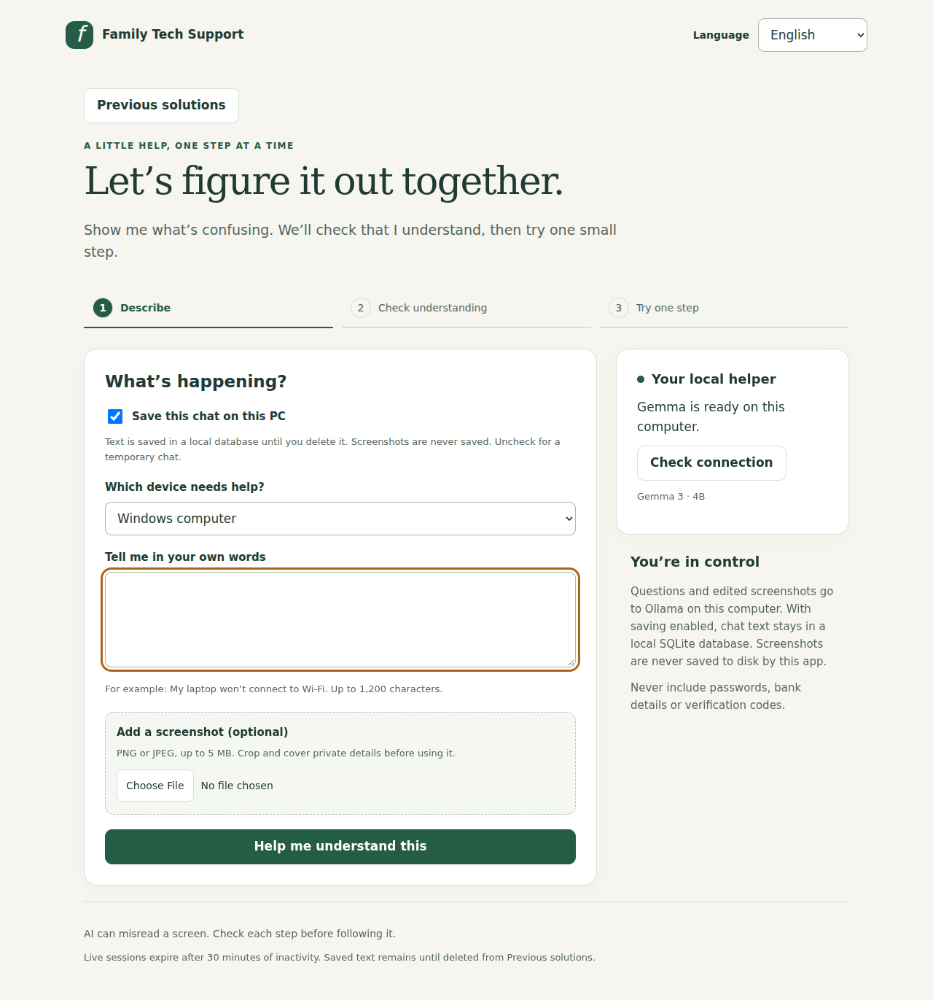

# Family Tech Support Assistant

A local screenshot assistant for a family member who needs patient help with
everyday phone and computer problems. Ask a plain-language question, optionally
show a screenshot, and receive one small step or a clarifying question.



Interface preview with a deterministic test model; it does not show real Gemma inference.

**Source release: 1.2.0.** This ZIP contains the complete local application,
Windows launcher, backend tests, browser tests, and design documentation. Tests
use a clearly identified fake model. Real Gemma accuracy, target-PC speed, and
Windows batch execution still require verification on your computer. No GitHub
repository, live demo, or DEV submission has been published on your behalf.

## Start on Windows

1. Install [Python 3.11 or newer](https://www.python.org/downloads/windows/),
   including the Python launcher. Check `py -3 --version` in PowerShell.
2. Install [Ollama](https://ollama.com/download/windows) and keep it running.
3. Finish downloading the model: `ollama pull gemma3:4b`. If you previously ran
   `ollama run gemma3:4b`, it downloads the same model. Type `/bye` to exit that
   interactive chat; Ollama's background service should remain running.
4. Extract this ZIP into a fresh folder. Open `family-tech-support` and
   double-click **start.bat**.
5. Open **http://127.0.0.1:8765** if the browser does not open automatically.
   Keep the command window open. Press Ctrl+C there to stop the app.

The launcher checks Python and any existing virtual environment. It installs a
compatible Pillow version and upgrades pip when setup is needed. Once dependencies
are installed, subsequent starts skip installation, so routine use can be offline.
Model and dependency downloads require internet. No API key, Docker, or Node.js
is needed to run the app. Node.js is only needed for optional browser testing.

You can open the interface while the model downloads. Click **Check connection**
afterward. Availability means the model is installed; it does not prove that
inference will fit on the GPU or produce a correct answer.

### Manual PowerShell setup

Run these inside the extracted `family-tech-support` folder:

```powershell
py -3 -m venv .venv
.\.venv\Scripts\python.exe -m pip install --upgrade pip
.\.venv\Scripts\python.exe -m pip install -r requirements.txt
.\.venv\Scripts\python.exe -m app.main
```

PowerShell activation and execution-policy changes are unnecessary. The older
command `python -m app.server` remains supported using the environment Python.

## Use the assistant

1. Choose **English**, **हिन्दी (Hindi)** or **ગુજરાતી (Gujarati)**, then the affected device.
2. Describe the problem. Optionally add a PNG/JPEG screenshot up to 5 MB.
3. In the screenshot editor, drag a rectangle or enter X/Y/width/height. Crop it
   or cover it in opaque black. Zoom changes the view; undo supports three edits.
   Check private details, then click **Use this edited screenshot**. Nothing uploads
   when you merely choose a file. Cancel preserves the previous committed image.
4. Click **Help me understand this**. Review the assistant’s problem statement,
   evidence and uncertainty. Edit incorrect fields before confirming.
5. Confirm to get one step, question or recommendation for trusted human help.
   Follow a step only when it matches what you see.
6. **It didn’t work** opens a result note. Saving records the failure before asking
   for a different action. **I need an explanation** records unclear separately.
7. Type observations or attach a fresh edited screenshot for a follow-up. Screenshots
   clear after successful answers; they do not silently accompany later replies.
8. **That worked!** explicitly marks the problem solved. **Start a new problem**
   clears the live session and allows a different language; saved text remains. Language is fixed per session.

The UI and requested model-answer language support all three languages. Actual
Gemma fluency needs local testing. Native browser file-picker labels may follow
Windows/browser language. The app runs on Windows; phone screenshots must be
transferred to the PC. There is no remote control or native phone app.

## Technology and structure

| Layer | Technology / classes | Responsibility |
| --- | --- | --- |
| Browser | HTML, CSS, JavaScript; `FamilySupportApp`, `AnswerView`, `ScreenshotEditor`, `LanguageService`, `ApiClient` | Input, translations, pixel editing, review, feedback, HTTP requests |
| HTTP | Python standard library; `LocalServer`, `RequestHandler` | Local serving, request sizes, host/origin checks |
| Controller | `ApiController` | Route requests to use cases |
| Application | `SupportService` | Analyze, correct, confirm, ask, outcomes, solve, reset and concurrency |
| Conversation storage | `SessionRepository` | Bounded, expiring sessions in memory |
| AI adapter | `OllamaClient` | Local Gemma calls and model failure handling |
| Supporting logic | `PromptBuilder`, `ImageProcessor`, `RequestValidator`, data classes | Prompt bounds, image conversion, validation, shared data |

Backend source is under `app/`; frontend source is under `app/static/`. Tests are
under `tests/`. See [SYSTEM_DESIGN.md](docs/SYSTEM_DESIGN.md) for patterns and
trade-offs, [CODE_GUIDE.md](docs/CODE_GUIDE.md) for the reading order, and
[API.md](docs/API.md) for request/response contracts. The design deliberately
uses ordinary classes and constructor arguments rather than a dependency-injection
framework or microservices. SQLite from Python’s standard library stores optional text history.

## Hardware and bounded work

Target: Windows, 16 GB RAM, RTX 3050 with 4 GB VRAM. The default model is
`gemma3:4b`, with text and image input. Its approximately 3.3 GB download does not
mean inference fits entirely in 4 GB VRAM. Ollama may split computation across
GPU and CPU. Real latency needs measuring on the target PC.

The app limits each request to one screenshot resized to a longest edge of 1600
pixels, a 4096-token context setting, 384 generated tokens, and one active model
call. Prompt text includes the approved understanding and compact failed-action summaries,
then retains the first and recent complete exchanges when they fit its character budget. Character count is an approximation, not a tokenizer;
image tokens and non-English text can still affect context capacity.

With **Save this chat on this PC** checked, text history is saved until you delete
it under **Previous solutions**. Uncheck before starting for a temporary chat.
Saved conversations are read-only; old advice is not automatically reused.

Each conversation has ten replies. The server holds at most twenty sessions and
expires idle sessions after thirty minutes. Expired entries are removed on the
next repository operation. Old screenshots are not kept in server history. The initial sanitized image is temporarily
retained in the draft until confirmation succeeds; reset/expiry also removes it.

For GPU-memory trouble, stop the app and run:

```powershell
.\.venv\Scripts\python.exe -m app.main --cpu-only
```

CPU mode uses system memory and may be slower. Close other active Ollama chats
when testing. Model requests time out after four minutes. A timed-out inference
may continue inside Ollama, so wait before retrying. Network failures after a
successful server commit can leave the browser's version stale; the app rejects
that stale request and asks you to start a new problem instead of silently
repeating the step.

## Privacy and advice limitations

The server binds to `127.0.0.1`. Ollama calls are hard-coded to local loopback,
ignore HTTP proxies, and reject redirects. There is no cloud fallback, analytics or question/image access logging. Optional
text snapshots persist in SQLite; screenshots are excluded. The browser uses
memory rather than localStorage. Original pixels and up to three undo snapshots exist
locally while editing. Closing the editor drops those references; the source file
on your PC is unchanged. Cover the entire private region with a margin. The app never executes AI output; it renders
plain text and validates the structured answer before accepting it.

Reset removes live server state, but keeps saved text history. Delete a saved chat
from **Previous solutions** to remove its database row. If that chat is still active,
further saving for it is disabled. Closing/reloading the page attempts a small cleanup
request; browser shutdown can interrupt it, so expiry and process shutdown are
the fallbacks. Logical deletion does not guarantee forensic memory erasure.
Ollama, browser extensions, OS swap/crash dumps, and their own caches/logs are
outside this app's control.

The prompt asks for reversible actions and trusted-human escalation for risky
issues. This is not a guarantee of safe advice. The model can misread screens or
invent details. Crop small text or type the exact error yourself, and evaluate
advice before following it. Never supply passwords, OTPs, or banking information.

## Database location and phone use

On Windows: `%LOCALAPPDATA%\FamilyTechSupport\history.sqlite3`. The launcher prints
the exact path. Override with `--history-db C:\path\history.sqlite3` if needed.
The app does not encrypt this file. Backup copies and OS storage may retain deleted text.

This release runs on the Windows PC. Your parent can transfer a phone screenshot
to the PC, use the assistant there, and follow steps on the phone. Opening
`127.0.0.1:8765` on a phone does not reach your PC. Phone-browser access needs a
separate paired LAN mode, which is not implemented in this release.

## Technical learning guide

A separate **34-page technical PDF** accompanies this release. It includes system
architecture, all fourteen UML diagram types, explanations linked to code, API
contracts, pixel mathematics, multilingual UX, privacy, tests and exercises. The
profile is a teaching-only view and the timing chart is schematic. Editable vector
drawings and the full text are in `tools/build_technical_pdf.py`.

To regenerate it (optional documentation dependency):

```powershell
.\.venv\Scripts\python.exe -m pip install -r requirements-docs.txt
.\.venv\Scripts\python.exe tools\build_technical_pdf.py
```

## Troubleshooting

| Symptom | What to do |
| --- | --- |
| Python missing or below 3.11 | Install a supported Python with the launcher; reopen PowerShell |
| Existing `.venv` uses old Python | Rename it to an unused backup name or extract into a fresh folder |
| Pillow installation fails | Check internet/Python; requirements allow `Pillow>=10.4.0,<13` |
| Cannot reach Ollama | Open Ollama; if needed run `ollama serve` in a separate window |
| Model missing | Let the download finish or run `ollama pull gemma3:4b` |
| Port busy | Run `python -m app.main --port 8766` using the environment Python |
| Conversation expired/full/changed | Use **Start a new problem** |
| Slow first answer or GPU error | Wait for model loading; try cropped images or `--cpu-only` |
| Corrupt screenshot | Take a fresh PNG/JPEG; renaming the extension does not convert a file |
| Incomplete model answer | Retry a shorter question; report a non-private reproduction if repeated |

## Open innovation and submission

Target: **Best Use of Gemma**, also aiming for the overall prize. Gemma is an
open-weight model governed by Google's Gemma terms; it is not covered by this
app's MIT license. Ollama is the local inference runtime. Pillow has its own
license. Model weights and inference binaries are not bundled with this source. Noto Indic
font subsets are bundled with their SIL Open Font License texts under `app/static/`.

The submission should show one actual recipient, actual feedback, and real local
model responses. [SUBMISSION_DRAFT.md](docs/SUBMISSION_DRAFT.md) provides an
outline and [DEMO_GUIDE.md](docs/DEMO_GUIDE.md) gives a recording plan. Fill the
placeholders using evidence; do not invent testing, testimonials, or performance.

References:
- [Gemma 3 model card](https://ai.google.dev/gemma/docs/core/model_card_3)
- [Gemma terms](https://ai.google.dev/gemma/terms)
- [Ollama Gemma 3](https://ollama.com/library/gemma3)
- [Ollama chat API](https://docs.ollama.com/api/chat)
- [Weekend challenge](https://dev.to/challenges/hacktoberfest-weekend-2026-10-01)

See [CONTRIBUTING.md](CONTRIBUTING.md) for contribution guidelines.
